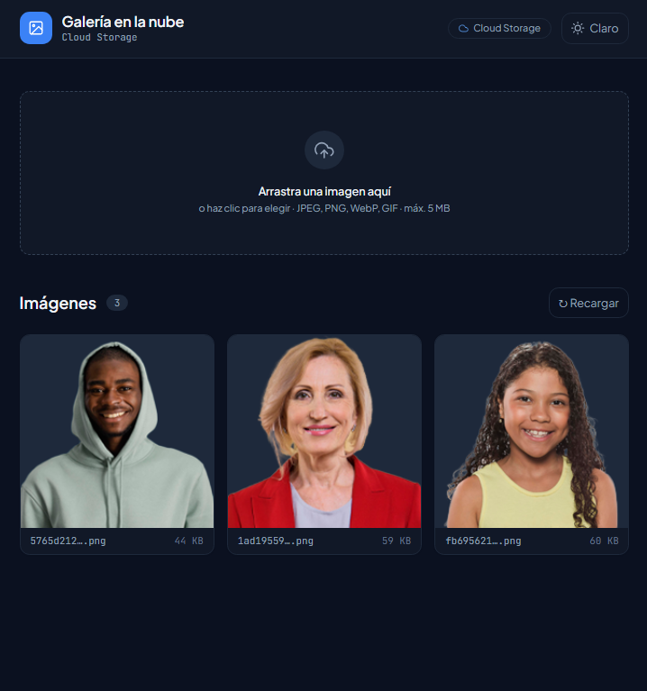
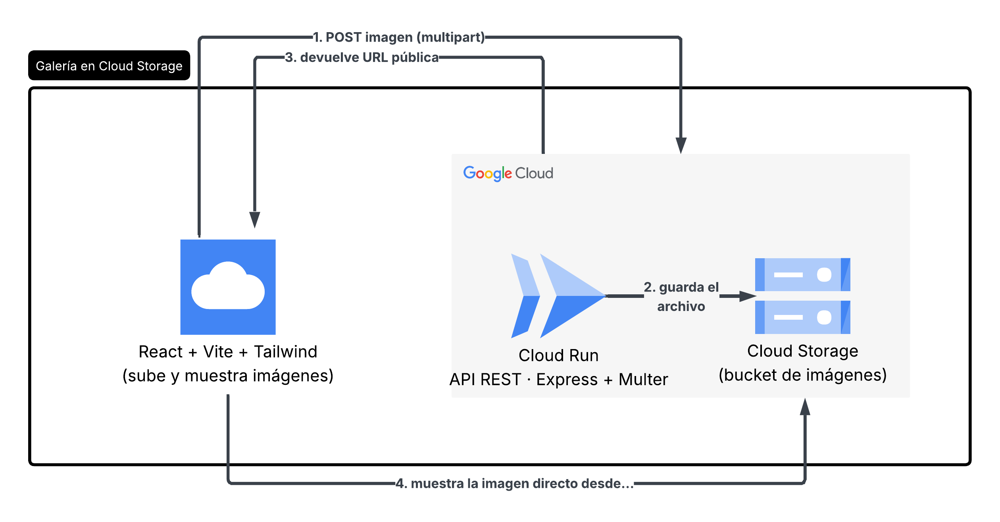
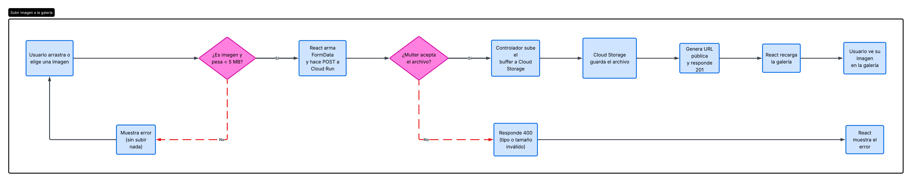
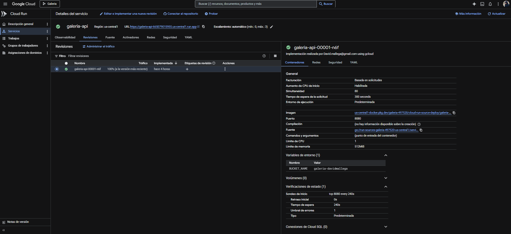
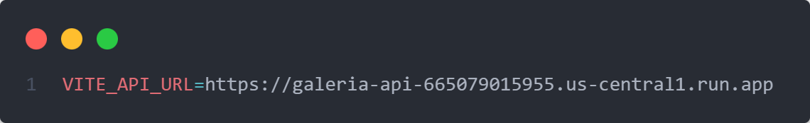
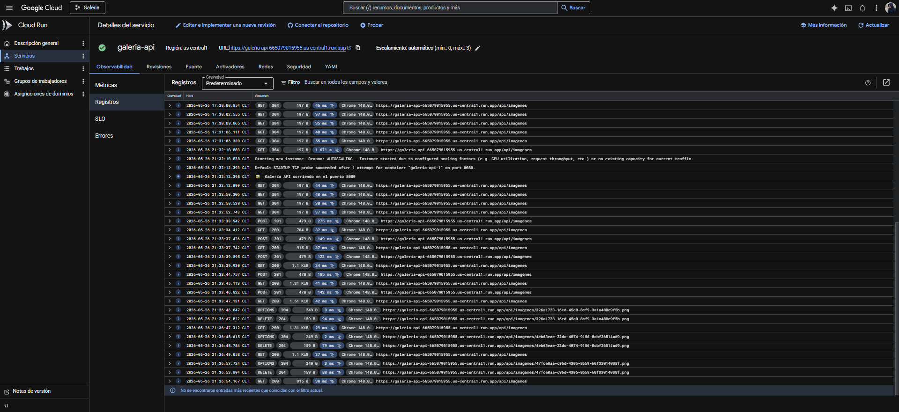
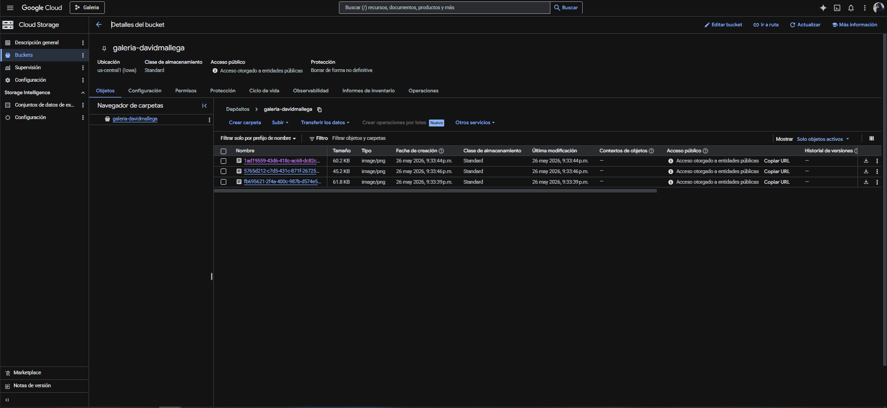
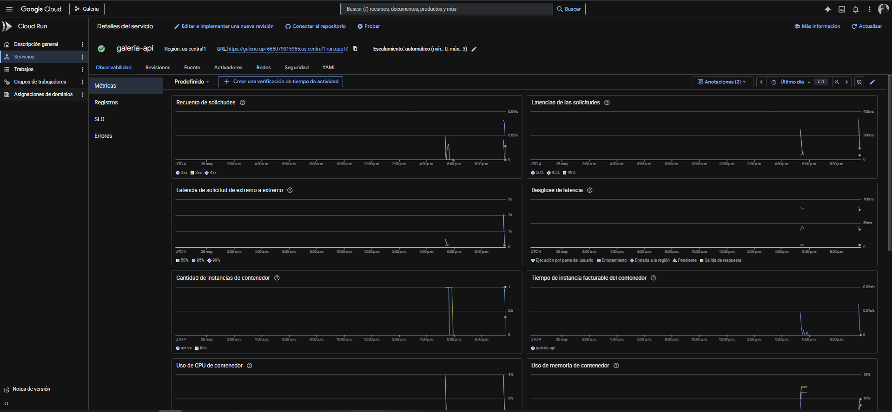

# Galería en la nube

Aplicación fullstack desplegada en producción. Frontend React que sube imágenes a Google Cloud Storage a través de una API serverless en Cloud Run, con manejo de archivos binarios, validación en doble capa y URLs públicas servidas directamente desde el bucket.

**Demo en vivo:** https://galeria-api-665079015955.us-central1.run.app/health

---

## Vista previa

| Modo claro | Modo oscuro |
|-----------|-------------|
|  |  |

---

## ¿Qué hace?

Galería de imágenes con subida por drag & drop, visualización y eliminación. El frontend nunca carga imágenes a través del backend — una vez subidas, el navegador las obtiene directamente desde Cloud Storage mediante su URL pública. Incluye validación de tipo y tamaño en cliente y servidor, modo claro/oscuro y los cuatro estados de interfaz (cargando, vacío, error, con datos).

---

## Stack

| Capa | Tecnología |
|------|-----------|
| Frontend | React 18 · Vite · Tailwind CSS |
| Backend | Node.js 20 · Express · Multer |
| Almacenamiento | Google Cloud Storage |
| Cómputo | Google Cloud Run (serverless, contenedores) |

---

## Arquitectura del sistema

El backend recibe la imagen como `multipart/form-data`, la guarda en el bucket y devuelve la URL pública. A partir de ese momento el navegador carga la imagen directo desde Storage, sin volver a pasar por Cloud Run.



```
React → POST imagen → Cloud Run → guarda en → Cloud Storage (bucket)
                                                      ↓
React ← muestra imagen ←──────── URL pública ←────────┘
```

---

## Flujo de subida

El sistema valida dos veces — en el cliente para evitar tráfico innecesario, y con Multer en el servidor porque no se confía en el cliente. Solo si pasa ambas validaciones, el archivo llega a Cloud Storage.



---

## Evidencia de despliegue

### Servicio activo en Cloud Run

El servicio `galeria-api` está activo en `us-central1` con escalamiento automático de 0 a 3 instancias. La variable `BUCKET_NAME` apunta al bucket de Cloud Storage.



### Conexión frontend → Cloud Run

La variable `VITE_API_URL` apunta al servicio de Cloud Run. Es el único cambio entre entorno local y producción.



### Variable de entorno del backend

`BUCKET_NAME=galeria-davidmallega` se inyecta en el contenedor en el momento del despliegue. El nombre del bucket no está hardcodeado en el código.


### Logs en producción

Los logs confirman el comportamiento esperado de la API en la nube:

- `POST 201 /api/imagenes` — imagen recibida, guardada en el bucket y URL devuelta al cliente.
- `DELETE 204 /api/imagenes/:nombre` — imagen eliminada del bucket con código semántico correcto.
- `GET 200 /api/imagenes` — listado de imágenes desde el bucket respondido con éxito.



### Bucket con imágenes almacenadas

Las imágenes en el bucket `galeria-davidmallega` tienen acceso público (`allUsers + objectViewer`). Cada objeto tiene una URL directa en `storage.googleapis.com`.



### Métricas del servicio



---

## Estructura

```
galeria/
├── backend/
│   ├── index.js
│   ├── Dockerfile
│   └── src/
│       ├── config/storage.js
│       ├── middleware/upload.js
│       ├── controllers/galeriaController.js
│       └── routes/galeria.js
└── frontend/
    └── src/
        ├── services/api.js
        ├── hooks/useGaleria.js · useTema.js
        └── components/ZonaSubida.jsx · TarjetaImagen.jsx · Iconos.jsx
```

---

## Correr en local

**Backend**
```bash
cd backend
npm install
gcloud auth application-default login
gcloud auth application-default set-quota-project TU-PROYECTO-ID
echo "BUCKET_NAME=TU-NOMBRE-BUCKET" > .env
npm run dev          # http://localhost:8080
```

**Frontend**
```bash
cd frontend
npm install
npm run dev          # http://localhost:5173
```

---

## Despliegue en Cloud Run

```bash
cd backend
gcloud run deploy galeria-api \
  --source . \
  --region us-central1 \
  --allow-unauthenticated \
  --set-env-vars BUCKET_NAME=TU-NOMBRE-BUCKET
```

Empaqueta el código en un contenedor vía Cloud Build y lo despliega en Cloud Run. El bucket se referencia únicamente por variable de entorno.

---

## Endpoints de la API

| Método | Ruta | Acción | Código |
|--------|------|--------|--------|
| GET | `/api/imagenes` | Lista todas las imágenes | 200 |
| POST | `/api/imagenes` | Sube una imagen (campo `imagen`) | 201 |
| DELETE | `/api/imagenes/:nombre` | Elimina una imagen | 204 |
| GET | `/health` | Estado del servicio | 200 |

---

## Decisiones técnicas

- **Multer en memoria (`memoryStorage`)**: el archivo nunca toca el disco del contenedor; se pasa como `Buffer` directo a la SDK de Storage, reduciendo latencia y eliminando limpieza de temporales.
- **URL pública vs. URL firmada**: acceso público para una galería de visualización abierta. Para contenido privado, la alternativa son URLs firmadas con tiempo de expiración.
- **Separación backend/frontend**: el frontend carga imágenes desde `storage.googleapis.com`, no a través del backend. Cloud Run no actúa como proxy de archivos binarios.
- **Sin credenciales en el código**: Application Default Credentials en local, cuenta de servicio propia de Cloud Run en producción con rol `storage.objectAdmin`.
- **Doble validación** (cliente + Multer): buena experiencia de usuario y seguridad real en el servidor.
